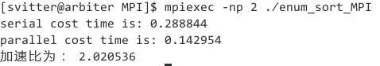

备注
===

配置
---
- Linux
    - Ubuntu
        - ubuntu下安装libopenmpi或者mpich均可。
        - 使用mpicc编译
    - CentOS
        - 安装mpich2的相关包
        - 使用mpicc编译
    - Arch
        - 直接pacman -S openmpi即可
- Windows
    - 注意vs建工程的时候x64位。

加速比
---
- 
- 数组大小为10000的情况下，加速比接近2.

小注：
---
- 利用debug函数检测结果是否正确
- 我本身使用自带的编译工具编译，动态的变量也可以使用。如numprocs.
- openmpi版本为了openmpi创建，基本误差异.
